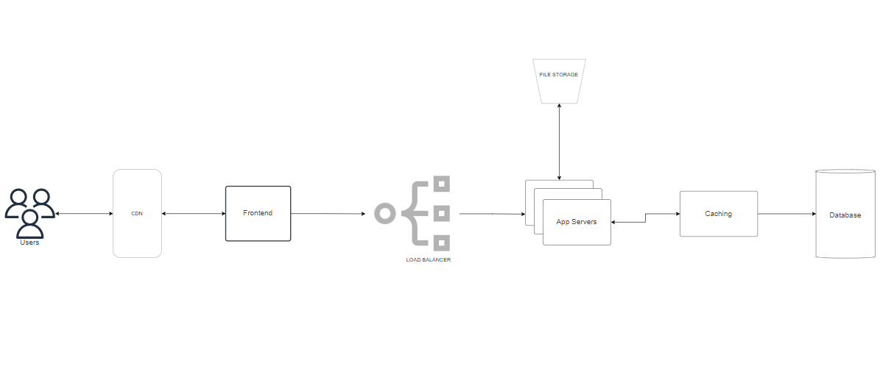
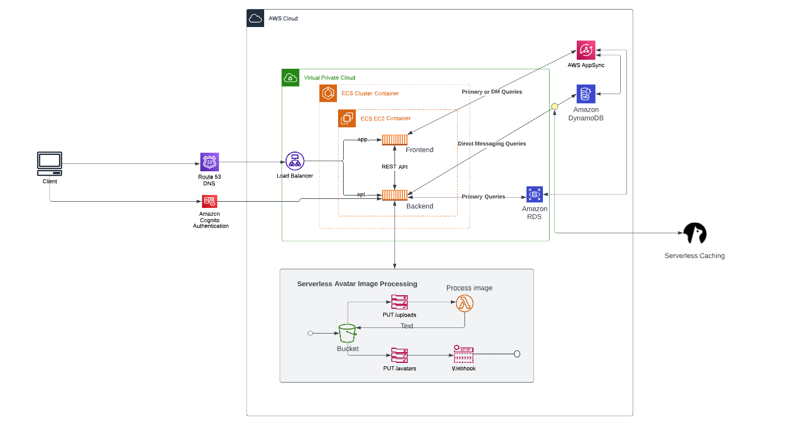
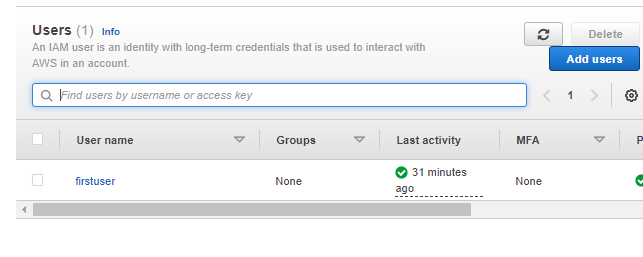

# Week 0 — Billing and Architecture

> [Overview](https://www.youtube.com/watch?v=SG8blanhAOg&list=PLBfufR7vyJJ7k25byhRXJldB5AiwgNnWv&index=12 )

## Conceptual Architectural Diagram



diagram link [here](https://drive.google.com/file/d/1_YwxL_bayS7ynSMRPpSoEIhtVynCgwrN/view?usp=sharing)

## Logical Architectural Diagram



diagram link [here](https://lucid.app/lucidchart/3ec59bb4-2918-4544-aeae-2b5766ed064e/edit?viewport_loc=-198%2C219%2C2974%2C1506%2C0_0&invitationId=inv_43435319-4954-4469-a3d7-dfa7333155de)

----------------------------------------------------------

## AWS CLI

- Installed AWS CLI
- updated [.gitpod.yml](../.gitpod.yml) to include:

  ```bash
  tasks:
  - name: aws-cli
    env:
      AWS_CLI_AUTO_PROMPT: on-partial
    init: |
      cd /workspace
      curl "https://awscli.amazonaws.com/awscli-exe-linux-x86_64.zip" -o "awscliv2.zip"
      unzip awscliv2.zip
      sudo ./aws/install
      cd $THEIA_WORKSPACE_ROOT
  ```

## Enable Billing

- [Billing Page](https://console.aws.amazon.com/billing/) -> `Billing Preferences` -> `Receive Billing Alerts`
- Save Preferences

## Creating a Billing Alarm

### Create SNS Topic

- We need an SNS topic before we create an alarm.
- The SNS topic is what will delivery us an alert when we get overbilled
- [aws sns create-topic](https://docs.aws.amazon.com/cli/latest/reference/sns/create-topic.html)

Creating an SNS Topic

```shell
aws sns create-topic --name billing-alarm
```

which will return a TopicARN

We'll create a subscription supply the TopicARN and our Email

```shell
aws sns subscribe \
    --topic-arn TopicARN \
    --protocol email \
    --notification-endpoint your@email.com
```

Check your email and confirm the subscription

#### Create Alarm

- [aws cloudwatch put-metric-alarm](https://docs.aws.amazon.com/cli/latest/reference/cloudwatch/put-metric-alarm.html)
- [Create an Alarm via AWS CLI](https://aws.amazon.com/premiumsupport/knowledge-center/cloudwatch-estimatedcharges-alarm/)
- We need to update the configuration json script with the TopicARN we generated earlier
- We are just a json file because --metrics is is required for expressions and so its easier to us a JSON file.

```sh
aws cloudwatch put-metric-alarm --cli-input-json file://aws/json/alarm_config.json
```

## Create an AWS Budget

[aws budgets create-budget](https://docs.aws.amazon.com/cli/latest/reference/budgets/create-budget.html)

Get your AWS Account ID

```sh
aws sts get-caller-identity --query Account --output text
```

- Supply your AWS Account ID
- Update the json files
- This is another case with AWS CLI its just much easier to json files due to lots of nested json

```bash
aws budgets create-budget \
    --account-id AccountID \
    --budget file://aws/json/budget.json \
    --notifications-with-subscribers file://aws/json/budget-notifications-with-subscribers.json
```

## Budgets using console

I use AWS Budgets to monitor and track my AWS spending so as to make adjustments to my usage and cost as required to ensure I dont exceed my budget.

Two budgets created:

- *My Zero-Spend Budget* - Tracks my credit spend and alerts me $0.01

- *Track Credit Spend* - Tracks my credit spend and alerts me via SNS if I go beyond 85% of my budget


## Identity Access and Management (IAM)

On IAM Console, I created a new user, and generated AWS credentials.



## Questions for each of the five pillars in the Well-Architected Tool

**Operational Excellence:**

- How do you manage your operations and risks?

- How do you monitor resources to improve performance?

- How do you manage and automate changes to your application and infrastructure?

- How do you respond to and learn from operational events?

**Security:**

- How do you protect your system and data?

- How do you manage identities and access?

- How do you prepare for security events?

- How do you secure your network?

**Reliability:**

- How do you recover from infrastructure or service disruptions?

- How do you handle change management?

- How do you test your system's recovery procedures?

- How do you anticipate and prevent failures?

**Performance Efficiency:**

- How do you use computing resources efficiently?

- How do you monitor your system to maintain performance?

- How do you use scaling to meet changing demands?

- How do you analyze and optimize performance?

**Cost Optimization:**

- How do you use cloud resources efficiently?

- How do you manage cost over time?

- How do you monitor usage and cost?

- How do you analyze and attribute expenditure?

These questions help identify potential areas of improvement in your architecture across each of the five pillars. By addressing the areas of improvement identified by the questions, you can ensure that your architecture is well-architected and optimized for the cloud.

## Summary

I completed the tasks for the week without any noteworthy challenges.
Tasks I completed this week:

- Watched all the video series for the week
- Created the conceptual diagram in Draw.io
- Created the logical architectural diagram in Luciddraw
- Created an AWS budget using the console and the CLI using the requisite config json file
- Cost Allocation Tags activated for tagged resources
- Explored Cost Explorer and Reports in AWS Cost Management, to analyze and generate reports on costs and budgets
- Managed Billing Alerts in Billing preferences to send alerts via SNS when a particular threshold is met
