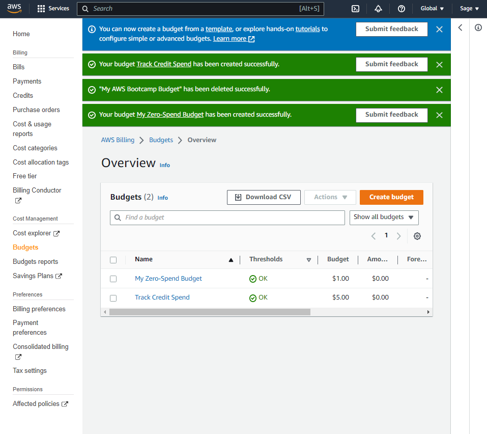

# Week 0 — Billing and Architecture

> [Overview](https://www.youtube.com/watch?v=SG8blanhAOg&list=PLBfufR7vyJJ7k25byhRXJldB5AiwgNnWv&index=12 )

## Budgets

I use AWS Budgets to monitor and track my AWS spending so as to make adjustments to my usage and cost as required to ensure I don't exceed my budget.

Two budgets created:

- *My Zero-Spend Budget* - Tracks my credit spend and alerts me $0.01

- *Track Credit Spend* - Tracks my credit spend and alerts me via SNS if I go beyond 85% of my budget

